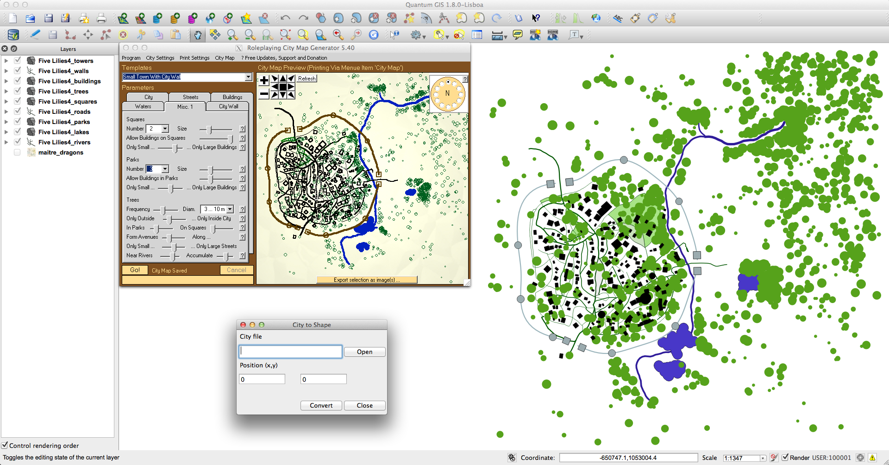

city2shape
==========

A tool to convert "Stadtplan-Dateien (*.sgs) Map File Format" from Roleplaying City Map Generator 5.4 to shape files

Installation
------------

1. Install Roleplaying City Map Generator 5.4 : http://www.stargazersworld.com/2009/02/27/roleplaying-city-map-generator/ or Search it on google!
2. Install Python 2.X : http://python.org/download/
3. Install GDAL : http://trac.osgeo.org/gdal/wiki/DownloadingGdalBinaries
4. Install GDAL-Python : http://trac.osgeo.org/gdal/wiki/GdalOgrInPython
5. Install WxPython : http://www.wxpython.org/download.php#stable
6. The converter will save as Google Mercator (EPSG:900913)
 
Your should be able to run the converter.

If you don't know what to use to view shape files use QGIS : http://www.qgis.org/

Preview
-------

Usage
-----

Use the open button to get your sgs file.

Use the (x, y) fields to set the position of you city (The coordinates must be meters as in EPSG:900913)

Press convert and go check the folder named after the sgs file name in the sgs file directory

Thanks
------

Thanks to the opensource community
Thanks to the OGC and OSGEO
Thanks to my gamemaster Nicklaus for those awesome games
Thanks to adube for this tutorial that started it all : https://github.com/adube/birthright-map/blob/master/README-raster.markdown

